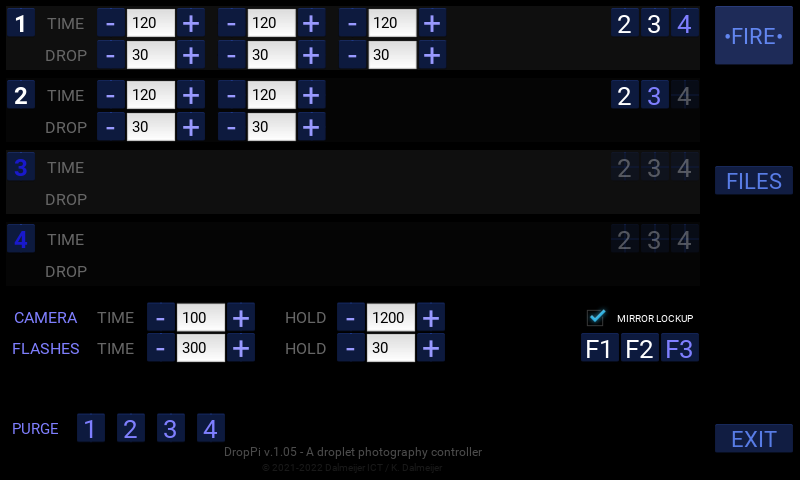
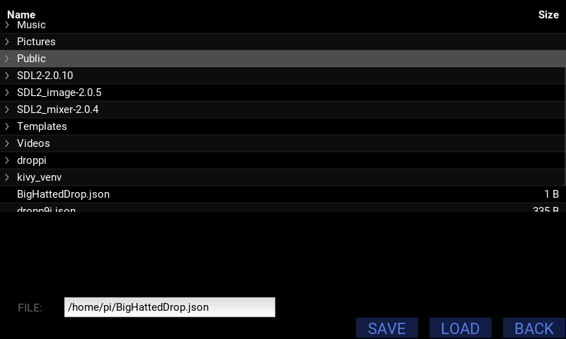

# DropPi v.1.05 #

DropPi is my own implementation of a python high-speed droplet photography controller for the Raspberry Pi4.

DropPi in its current version implements the following features:

- Controls up to 4 valves with a maximum of 4 individual drops per valve
- Controls up to 3 flashes
- Controls a DSLR or other wired trigger camera
- Supports mirror lockup function to eliminate camera shake
- Very accurate timing up to tenths of a millisecond with an average timing error of no more than 0.5%
- Uses standard hardware (minimal soldering)
- Fully supports the Raspberry 7" touch screen
- Input via touch screen and on-screen keyboard
- Long-press on all decrease and increase buttons for slow and fast modes
- Save and load all your droplet configurations for later use

## History ##

Back in 2012 I had my first attempt at high-speed droplet photography using an Arduino. Because the Arduino was too slow, I encountered many issues and although I made some great images, it was frustrating.
Now, in 2021, I decided I would take the time to give it another go but this time my platform of choice would be the Raspberry Pi4. 
I also really wanted to get rid of using a bulky computer or laptop, so my goal was to use the 7 inch Raspberry touch screen and I wanted this to be my only interface.

Doing some initial investigations, I encountered an article by [Harald Kreuzer](https://www.haraldkreuzer.net/en/news/photographing-water-drops-raspberry-pi-control-device). Harald describes using Kivy to build the user interface and gave me a rough idea of how a user interface could look like. 
I've tried contacting Harald several times, asking whether he would be willing to share his work, but I never received any reply. I very much believe in open source so I decided to do my own investigations, my own hardware selection and my own programming.

The current result is what you are looking at. And since I am all about open source, contrary to Harald **I will share** with you!

## Hardware ##

As far as hardware goes, I am using the following components. I suggest you do the same.

- [Raspberry Pi4](https://www.raspberrypi.com/products/raspberry-pi-4-model-b/). Get as much memory as you can, it always helps
- [Raspberry Pi Touch Display](https://www.raspberrypi.com/products/raspberry-pi-touch-display/)
- [Seeed Relay HAT](https://wiki.seeedstudio.com/Raspberry_Pi_Relay_Board_v1.0/) (you need 2 of them)
- A power supply for your Raspberry. Make sure it can provide 5A, otherwise you'll run into issues!

**_IMPORTANT:_** Set the I2C addresses of the relay HATs to 20 and 21. I use these hardcoded in the software. Refer to the user manual for the relay HATs on how to set these addresses.

The first relay HAT will control the four valves in order (relay 1 - valve 1, etc.).
The second relay HAT will control the camera and flashes (camera, flash1, flash2, flash3).

I will update and expand this readme over time.

## Screenshots

